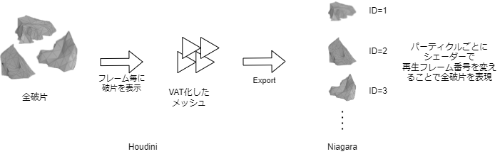

## VAT - Niagara
**作品のyoutube**

### 概要
<table>
<tr>
    <td>使用ソフト</td>
    <td>Unreal Engine 5<br>Houdini</td>
</tr>
<tr>
    <td>製作期間</td>
    <td>2ヶ月</td>
</tr>
</table>
<br>

古代遺跡で遭遇する不可思議な現象をテーマにエフェクトを作りました。
エフェクト後半部ではVAT（頂点アニメーションテクスチャ）のシェーダを用いてNiagaraだけではできなかった物理演算と
パーティクルシステムの組み合わせの表現を実現しました。
TODO:続き

### 天使像の破片エフェクト

#### Niagaraの問題点とHoudiniの活用による解決

本作品を制作するにあたり最大の課題はNiagaraを用いて天使像の破片の物理演算の表現とパーティクルシステムの表現を組み合わせることでした。
Niagaraは仕様上、一つのエミッタシステムに破片のような複数の形状のメッシュを割り当てることはできず、破片が飛び散るような複雑な物理演算も不向きです。
そこで、Houdiniを活用し以下の解決を図りました。
- VATを活用し1つのメッシュで複数の破片を表現する。
- 物理演算を事前に計算し、その点群データをNiagaraで読み込む。

#### VATでの破片表現

Niagaraでパーティクルとして破片を表示させるため、VATを用いて同一のメッシュで各破片を表現する手法を取りました。
フレームごとに1つずつ破片を表示するアニメーションをつけたVATシェーダー付きメッシュを作成し、Niagaraでシェーダーのフレーム番号のパラメータを変更することで各破片を表現しました。

**破片のExploded Viewと各フレームの破片**




#### 物理演算

##### Houdiniでの演算

内側からの力で破片が全方位に均等に飛び散り、降ってくる様子が視界に収まるように力の調整を行いました

**図**
最終的な物理演算結果

**図**
速度ベクトルを付加する

**図**
下部の破片を物理演算しないよう設定

**図**
飛び散らずに台座に残った内側の破片を削除

##### Niagaraでの再生

物理演算を行った破片のアニメーションは点群として出力し、Niagaraで読み込んで再生します。

**図**
Niagaraで読み込んだ破片のアニメーション

点群に元の破片のVATのフレーム番号や回転の情報、初期位置も属性として付加しているため、この情報を元にNiagaraで元の物理演算を復元します。

#### 物理演算とパーティクルシステムの組み合わせ

読み込んだ物理演算をすべて再生するのではなく、途中でNigaraによる中央を旋回するアニメーションに切り替え、最終的に点群情報に付加された初期位置に戻します。

**遷移の説明**

### 魔法エフェクト

**魔法エフェクト**

このエフェクトは4種類のエミッタシステムで構成されています。

1. 線
**画像**
2. ルーン文字
**画像**
3. 最初の火花
**画像**
4. 最後の火花
**画像**

ルーン文字のエフェクトは文字が一覧になっているFlipBookテクスチャからランダムに文字を表示させています。
このFlipBookテクスチャはシェルスクリプトを記述して自動で生成できるようにしました。
このスクリプトの生成する文字やフォントの記述を変えるだけで何種類ものFlipBookテクスチャのパターンが作成できるため、見栄えを試行錯誤するのに役立ちました。

```bash
スクリプト
```


### 爆発エフェクト

### 背景

### コンポジット

## Builing Generator


## KUMALEON Promotion Video


## Pyro & RBD